# 画面項目定義書

## 目次

1. [Dashboard（ダッシュボード）](#1-dashboard)
2. [Daily（日次管理）](#2-daily)
3. [Attendance（勤怠管理）](#3-attendance)
4. [Projects（プロジェクト管理）](#4-projects)
5. [Calendar（カレンダー）](#5-calendar)
6. [Reports（レポート）](#6-reports)
7. [Holidays（休日管理）](#7-holidays)
8. [Routine（ルーティン設定）](#8-routine)
9. [EVM（EVM管理）](#9-evm)
10. [Salary（給与管理）](#10-salary)
11. [Sleep（睡眠管理）](#11-sleep)
12. [Kadmin（稼働管理）](#12-kadmin)

---

## 1. Dashboard

### 画面概要
アプリケーションのメイン画面。今日の勤怠状況、今週の稼働時間、タスクの状況、タイマーの状態など、重要な情報を一覧表示します。

### 画面イメージ
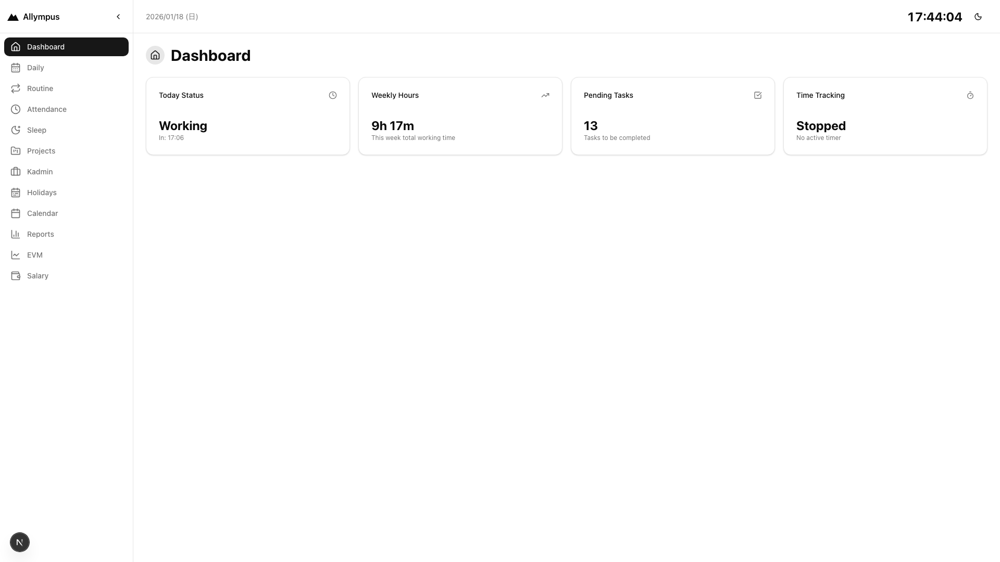

### レイアウト構成
```
┌────────────────────────────────────────────────────┐
│ 🏠 Dashboard                                       │
├────────────────────────────────────────────────────┤
│ ┌──────────┐ ┌──────────┐ ┌──────────┐ ┌────────┐│
│ │Today     │ │Weekly    │ │Pending   │ │Time    ││
│ │Status    │ │Hours     │ │Tasks     │ │Tracking││
│ └──────────┘ └──────────┘ └──────────┘ └────────┘│
└────────────────────────────────────────────────────┘
```

### 画面項目

#### ヘッダー
| 項目名 | 項目種別 | 表示内容 | 備考 |
|--------|----------|----------|------|
| アイコン | アイコン | Home | 画面識別用 |
| タイトル | テキスト | Dashboard | 画面名 |

#### カードエリア（4列グリッド）

**Today Status カード**
| 項目名 | 項目種別 | 表示内容 | 備考 |
|--------|----------|----------|------|
| アイコン | アイコン | Clock | - |
| ステータス | テキスト | Working / Checked Out / Not Started | 勤怠状態 |
| 出勤時刻 | テキスト | In: HH:mm | clockInの時刻 |
| 退勤時刻 | テキスト | Out: HH:mm | clockOutの時刻（退勤済みの場合のみ） |

**Weekly Hours カード**
| 項目名 | 項目種別 | 表示内容 | 備考 |
|--------|----------|----------|------|
| アイコン | アイコン | TrendingUp | - |
| 週次稼働時間 | テキスト | Xh Ym | 今週の総稼働時間（休憩時間除く） |
| 説明 | テキスト | This week total working time | - |

**Pending Tasks カード**
| 項目名 | 項目種別 | 表示内容 | 備考 |
|--------|----------|----------|------|
| アイコン | アイコン | CheckSquare | - |
| タスク数 | 数値 | N | ステータスがTODOのタスク数 |
| 説明 | テキスト | Tasks to be completed | - |

**Time Tracking カード**
| 項目名 | 項目種別 | 表示内容 | 備考 |
|--------|----------|----------|------|
| アイコン | アイコン | Timer | - |
| ステータス | テキスト | Active / Stopped | タイマーの状態 |
| タスク情報 | テキスト | Working on: [タスク名] / No active timer | アクティブなタイマーがある場合はタスク名を表示 |

---

## 2. Daily

### 画面概要
日次の業務管理画面。日付選択、出勤/退勤、朝のルーティン、タスク管理、稼働実績入力など、1日の業務に関する全ての情報を管理します。

### 画面イメージ
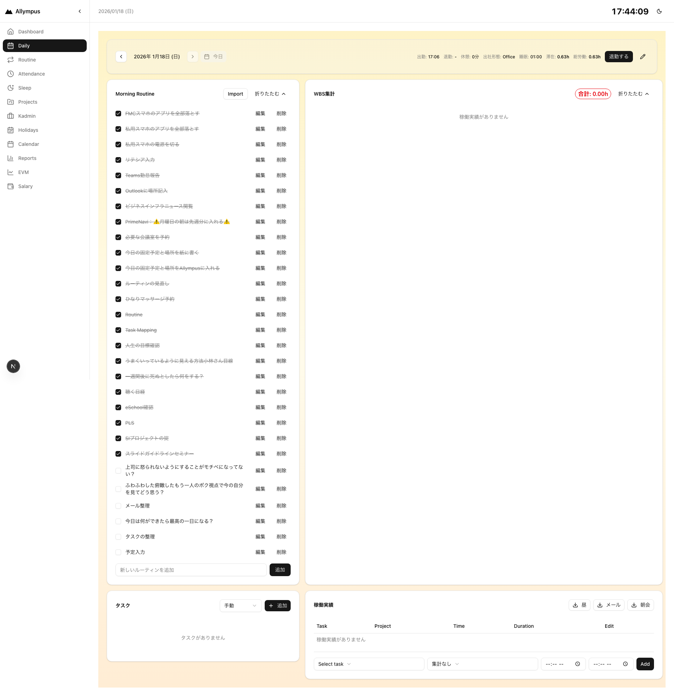

### レイアウト構成
```
┌────────────────────────────────────────────────────┐
│ Attendance Banner + Date Navigator                │
├────────────────────────────────────────────────────┤
│ ┌──────────────┐  ┌──────────────────────────────┐│
│ │Morning       │  │WBS Summary                   ││
│ │Routine       │  │                              ││
│ └──────────────┘  └──────────────────────────────┘│
├────────────────────────────────────────────────────┤
│ ┌──────────────┐  ┌──────────────────────────────┐│
│ │Daily Tasks   │  │Daily Time Entry Table        ││
│ │              │  │                              ││
│ └──────────────┘  └──────────────────────────────┘│
└────────────────────────────────────────────────────┘
```

### 画面項目

#### 勤怠バナー（DailyAttendanceBanner）
| 項目名 | 項目種別 | 表示内容 | 備考 |
|--------|----------|----------|------|
| 日付ナビゲーター | 日付選択 | ← [YYYY/MM/DD (曜日)] → | 前日/翌日ボタン付き |
| 出勤時刻 | テキスト | 出勤: HH:mm | チェックイン済みの場合 |
| 退勤時刻 | テキスト | 退勤: HH:mm | チェックアウト済みの場合 |
| 休憩時間 | テキスト | 休憩: Xm | 勤怠データ + TimeEntry計算 |
| 稼働時間 | テキスト | 稼働: Xh Ym | 出勤から退勤までの時間 - 休憩 |
| 退勤ボタン | ボタン | 退勤 | 当日かつ未退勤の場合のみ表示 |

#### チェックイン画面（未チェックイン時）
| 項目名 | 項目種別 | 入力形式 | 必須 | 備考 |
|--------|----------|----------|------|------|
| 出勤時間 | 時刻入力 | HH:mm | ○ | デフォルト: 現在時刻 |
| 出社形態 | セレクト | Office / Telework / Out of Office | ○ | - |
| 睡眠時間 | 数値入力 | 0.0 ~ 24.0 | ○ | 単位: 時間 |
| チェックインボタン | ボタン | チェックイン | - | - |

#### Morning Routine カード
| 項目名 | 項目種別 | 入力形式 | 備考 |
|--------|----------|----------|------|
| Importボタン | ボタン | Import | テンプレートから取り込み |
| 折りたたみボタン | ボタン | 開く/折りたたむ | - |
| ルーティン項目リスト | チェックボックス | ☑ [タイトル] | 各項目に編集/削除ボタン |
| 新規追加入力 | テキスト入力 | 新しいルーティンを追加 | - |
| 追加ボタン | ボタン | 追加 | - |

#### WBS Summary カード
| 項目名 | 項目種別 | 表示内容 | 備考 |
|--------|----------|----------|------|
| 総稼働時間 | テキスト | Xh Ym | 出退勤ベースの稼働時間 |
| プロジェクト別集計 | リスト | [プロジェクト名 - WBS]: Xh Ym | 各プロジェクト/WBSごとの稼働時間 |

#### Daily Task Panel
| 項目名 | 項目種別 | 入力形式 | 備考 |
|--------|----------|----------|------|
| タスクリスト | リスト | タスクアイテム | ステータス、タイトル、開始/終了ボタン |
| タスク作成フォーム | フォーム | - | タイトル、プロジェクト、WBS選択 |

#### Daily Time Entry Table
| 項目名 | 項目種別 | 入力形式 | 備考 |
|--------|----------|----------|------|
| 稼働実績テーブル | テーブル | 開始時刻、終了時刻、プロジェクト、WBS、タスク | 編集/削除可能 |
| 新規作成ボタン | ボタン | 追加 | - |
| テンプレート取込 | ボタン | Import | 定型稼働予定からの一括取込 |

---

## 3. Attendance

### 画面概要
勤怠記録の一覧と統計情報を表示する画面。当日の勤怠状況、月次の統計、勤怠履歴を確認できます。

### 画面イメージ
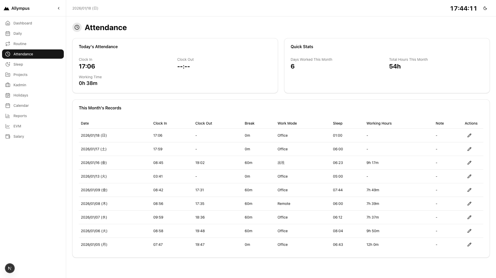

### レイアウト構成
```
┌────────────────────────────────────────────────────┐
│ 🕐 Attendance                                      │
├────────────────────────────────────────────────────┤
│ ┌──────────────────┐  ┌──────────────────────────┐│
│ │Today's Attendance│  │Quick Stats               ││
│ └──────────────────┘  └──────────────────────────┘│
├────────────────────────────────────────────────────┤
│ ┌────────────────────────────────────────────────┐│
│ │This Month's Records                            ││
│ │[勤怠記録テーブル]                              ││
│ └────────────────────────────────────────────────┘│
└────────────────────────────────────────────────────┘
```

### 画面項目

#### ヘッダー
| 項目名 | 項目種別 | 表示内容 | 備考 |
|--------|----------|----------|------|
| アイコン | アイコン | Clock | - |
| タイトル | テキスト | Attendance | - |

#### Today's Attendance カード
| 項目名 | 項目種別 | 表示内容 | 備考 |
|--------|----------|----------|------|
| Clock In | テキスト | HH:mm | 出勤時刻（未出勤は --:--） |
| Clock Out | テキスト | HH:mm | 退勤時刻（未退勤は --:--） |
| Working Time | テキスト | Xh Ym | 稼働時間（出退勤時刻 - 休憩） |

#### Quick Stats カード
| 項目名 | 項目種別 | 表示内容 | 備考 |
|--------|----------|----------|------|
| Days Worked This Month | 数値 | N | 出勤・退勤済みの日数 |
| Total Hours This Month | テキスト | Xh | 月次総稼働時間 |

#### This Month's Records テーブル
| 項目名 | 項目種別 | 表示内容 | 備考 |
|--------|----------|----------|------|
| 勤怠リスト | テーブル | 日付、出勤、退勤、休憩、稼働時間、操作 | 編集可能 |

---

## 4. Projects

### 画面概要
プロジェクト・WBS管理画面。プロジェクトの登録、編集、WBS追加、並び替え、CSV一括登録などの機能を提供します。

### 画面イメージ
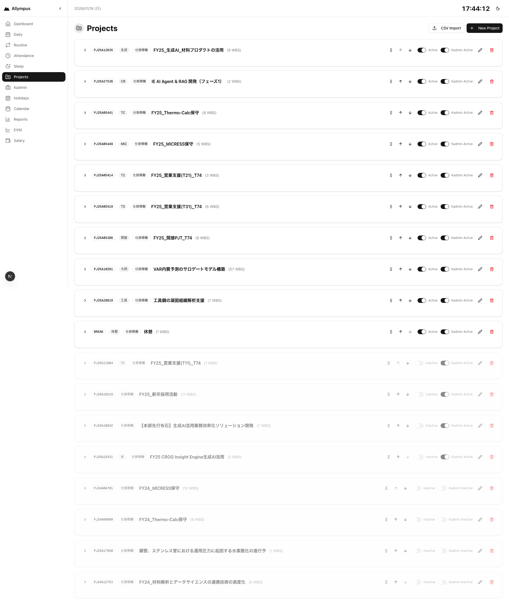

### レイアウト構成
```
┌────────────────────────────────────────────────────┐
│ 📁 Projects                    [CSV Import] [New]  │
├────────────────────────────────────────────────────┤
│ ┌────────────────────────────────────────────────┐│
│ │Project List                                    ││
│ │  - Project A                                   ││
│ │    ├ WBS1                                      ││
│ │    └ WBS2                                      ││
│ │  - Project B                                   ││
│ └────────────────────────────────────────────────┘│
└────────────────────────────────────────────────────┘
```

### 画面項目

#### ヘッダー
| 項目名 | 項目種別 | 操作 | 備考 |
|--------|----------|------|------|
| アイコン | アイコン | - | FolderKanban |
| タイトル | テキスト | - | Projects |
| CSV Importボタン | ボタン | クリック | CSVから一括登録 |
| New Projectボタン | ボタン | クリック | 新規プロジェクト作成 |

#### プロジェクトリスト
| 項目名 | 項目種別 | 表示内容 | 操作 |
|--------|----------|----------|------|
| プロジェクト名 | テキスト | [コード] プロジェクト名 | - |
| 稼働タイプ | バッジ | Project / Support / Fixed / Break | - |
| アクティブ状態 | スイッチ | Active / Inactive | トグル可能 |
| Kadminアクティブ | スイッチ | ON / OFF | トグル可能 |
| WBSリスト | リスト | WBS名 | 追加/編集/削除可能 |
| 並び替えボタン | ボタン | ↑ ↓ ⋮ | ドラッグ&ドロップまたはボタン |
| 編集ボタン | ボタン | 編集 | - |
| 削除ボタン | ボタン | 削除 | - |

#### プロジェクト作成/編集フォーム
| 項目名 | 項目種別 | 入力形式 | 必須 | 備考 |
|--------|----------|----------|------|------|
| コード | テキスト | 自由入力 | ○ | プロジェクトコード |
| 名称 | テキスト | 自由入力 | ○ | プロジェクト名 |
| 略称 | テキスト | 自由入力 | - | 表示用略称 |
| 稼働タイプ | セレクト | Project / Support / Fixed / Break | ○ | - |
| WBSリスト | 動的リスト | テキスト入力 | - | 複数追加可能 |

---

## 5. Calendar

### 画面概要
月次カレンダー形式で勤怠状況を表示し、月次サマリーや勤怠レコードの一覧を確認できる画面。

### 画面イメージ
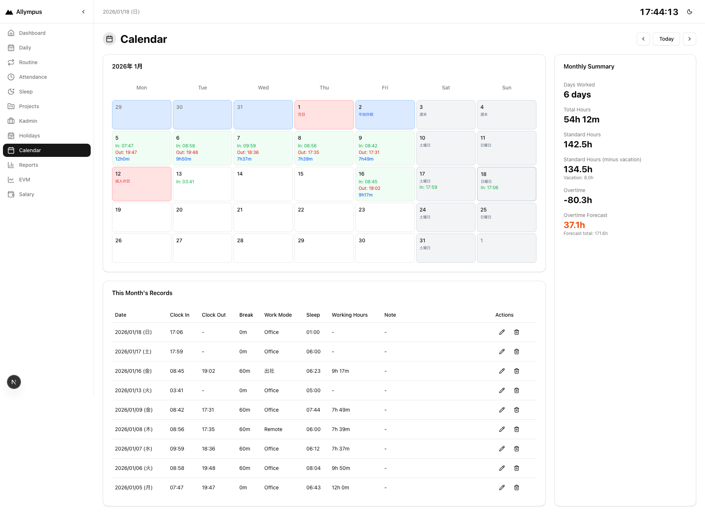

### レイアウト構成
```
┌────────────────────────────────────────────────────┐
│ 📅 Calendar          [←] [Today] [→]              │
├────────────────────────────────────────────────────┤
│ ┌──────────────────────┐  ┌──────────────────────┐│
│ │Calendar (月次)       │  │Monthly Summary       ││
│ │                      │  │                      ││
│ └──────────────────────┘  └──────────────────────┘│
├────────────────────────────────────────────────────┤
│ ┌────────────────────────────────────────────────┐│
│ │This Month's Records                            ││
│ │[勤怠記録一覧]                                  ││
│ └────────────────────────────────────────────────┘│
└────────────────────────────────────────────────────┘
```

### 画面項目

#### ヘッダー
| 項目名 | 項目種別 | 操作 | 備考 |
|--------|----------|------|------|
| アイコン | アイコン | - | Calendar |
| タイトル | テキスト | - | Calendar |
| 前月ボタン | ボタン | クリック | 前月へ移動 |
| Todayボタン | ボタン | クリック | 今月へ移動 |
| 次月ボタン | ボタン | クリック | 次月へ移動 |

#### カレンダー表示
| 項目名 | 項目種別 | 表示内容 | 備考 |
|--------|----------|----------|------|
| タイトル | テキスト | yyyy年 M月 | - |
| カレンダーグリッド | グリッド | 日付セル | 各日の勤怠状況を表示 |
| 日付セル | セル | 日付、稼働時間、休日マーク | クリック可能 |

#### Monthly Summary カード
| 項目名 | 項目種別 | 表示内容 | 備考 |
|--------|----------|----------|------|
| Days Worked | 数値 | N days | 出勤日数 |
| Total Hours | テキスト | Xh Ym | 総稼働時間 |
| Standard Hours | テキスト | Xh | 標準稼働時間（営業日 × 7.5h） |
| Standard Hours (minus vacation) | テキスト | Xh | 標準稼働時間 - 有休取得時間 |
| Overtime | テキスト | Xh | 残業時間（実稼働 - 標準） |
| Overtime Forecast | テキスト | Xh | 残業予測（現在のペースで計算） |

#### This Month's Records
| 項目名 | 項目種別 | 表示内容 | 備考 |
|--------|----------|----------|------|
| レコード一覧 | テーブル | 日付、出勤、退勤、稼働時間 | インライン編集可能 |

---

## 6. Reports

### 画面概要
月次レポート画面。稼働時間の統計、日別内訳、プロジェクト/WBS別集計、稼働タイプ別割合推移などを表示します。

### 画面イメージ
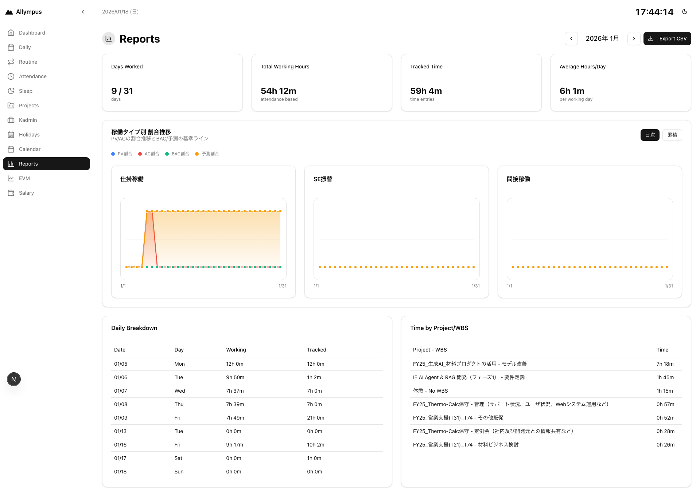

### レイアウト構成
```
┌────────────────────────────────────────────────────┐
│ 📊 Reports          [←] YYYY年M月 [→] [Export CSV]│
├────────────────────────────────────────────────────┤
│ ┌────┐ ┌────┐ ┌────┐ ┌────┐                      │
│ │Days│ │Total│ │Track│ │Avg │                      │
│ └────┘ └────┘ └────┘ └────┘                      │
├────────────────────────────────────────────────────┤
│ ┌────────────────────────────────────────────────┐│
│ │稼働タイプ別 割合推移（グラフ）                ││
│ └────────────────────────────────────────────────┘│
├────────────────────────────────────────────────────┤
│ ┌──────────────────┐  ┌──────────────────────────┐│
│ │Daily Breakdown   │  │Time by Project/WBS       ││
│ └──────────────────┘  └──────────────────────────┘│
└────────────────────────────────────────────────────┘
```

### 画面項目

#### ヘッダー
| 項目名 | 項目種別 | 操作 | 備考 |
|--------|----------|------|------|
| アイコン | アイコン | - | BarChart3 |
| タイトル | テキスト | - | Reports |
| 前月ボタン | ボタン | クリック | - |
| 月表示 | テキスト | yyyy年 M月 | - |
| 次月ボタン | ボタン | クリック | - |
| Export CSVボタン | ボタン | クリック | CSVダウンロード |

#### サマリーカード
| カード名 | 表示項目 | 表示内容 |
|----------|----------|----------|
| Days Worked | 稼働日数 | N / M days |
| Total Working Hours | 総稼働時間 | Xh Ym (attendance based) |
| Tracked Time | トラッキング時間 | Xh Ym (time entries) |
| Average Hours/Day | 平均稼働時間 | Xh Ym (per working day) |

#### 稼働タイプ別 割合推移
| 項目名 | 項目種別 | 表示内容 | 備考 |
|--------|----------|----------|------|
| タイトル | テキスト | 稼働タイプ別 割合推移 | - |
| 説明 | テキスト | PV/ACの割合推移とBAC/予測の基準ライン | - |
| 表示モード切替 | ボタン | 日次 / 累積 | - |
| グラフカード | グラフ | Project / Support / Fixed タイプ別の折れ線グラフ | PV、AC、BAC、予測ラインを表示 |

#### Daily Breakdown テーブル
| 項目名 | 項目種別 | 表示内容 | 備考 |
|--------|----------|----------|------|
| Date | テキスト | MM/dd | - |
| Day | テキスト | 曜日 | - |
| Working | テキスト | Xh Ym | 勤怠ベース |
| Tracked | テキスト | Xh Ym | TimeEntryベース |

#### Time by Project/WBS テーブル
| 項目名 | 項目種別 | 表示内容 | 備考 |
|--------|----------|----------|------|
| Project - WBS | テキスト | プロジェクト名 - WBS名 | - |
| Time | テキスト | Xh Ym | 稼働時間 |

---

## 7. Holidays

### 画面概要
休日管理画面。年度ごとの休日をカレンダー形式で表示し、祝日・定休日・特別休日・有給休暇を管理します。

### 画面イメージ
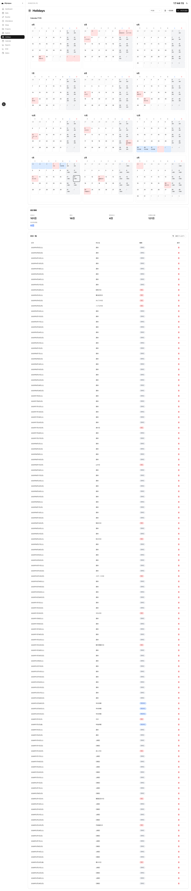

### レイアウト構成
```
┌────────────────────────────────────────────────────┐
│ 📅 Holidays   [FY選択] [一括登録] [休日を追加]   │
├────────────────────────────────────────────────────┤
│ ┌────────────────────────────────────────────────┐│
│ │Calendar FY25                                   ││
│ │[12ヶ月分のカレンダー]                         ││
│ └────────────────────────────────────────────────┘│
├────────────────────────────────────────────────────┤
│ ┌────────────────────────────────────────────────┐│
│ │統計情報                                        ││
│ │定休日: N日  祝日: N日  特別休日: N日 ...     ││
│ └────────────────────────────────────────────────┘│
├────────────────────────────────────────────────────┤
│ ┌────────────────────────────────────────────────┐│
│ │休日一覧 [表示フィルター▼]                     ││
│ │[休日テーブル]                                  ││
│ └────────────────────────────────────────────────┘│
└────────────────────────────────────────────────────┘
```

### 画面項目

#### ヘッダー
| 項目名 | 項目種別 | 操作 | 備考 |
|--------|----------|------|------|
| アイコン | アイコン | - | CalendarRange |
| タイトル | テキスト | - | Holidays |
| 年度選択 | セレクト | FY25, FY26, FY27 | - |
| 一括登録ボタン | ボタン | クリック | CSVから一括登録 |
| 休日を追加ボタン | ボタン | クリック | 単一休日追加 |

#### カレンダー表示
| 項目名 | 項目種別 | 表示内容 | 備考 |
|--------|----------|----------|------|
| タイトル | テキスト | Calendar FY25 | - |
| 月次カレンダー | グリッド | 4月〜3月の12ヶ月分 | 休日に色付き |

#### 統計情報
| 項目名 | 項目種別 | 表示内容 | 備考 |
|--------|----------|----------|------|
| 定休日 | 数値 | N日 | WEEKEND |
| 祝日 | 数値 | N日 | PUBLIC_HOLIDAY |
| 特別休日 | 数値 | N日 | SPECIAL_HOLIDAY |
| 年間休日数 | 数値 | N日 | 上記3つの合計 |
| 有休取得数 | 数値 | N日 | PAID_LEAVE |

#### 休日一覧テーブル
| 項目名 | 項目種別 | 表示内容 | 操作 |
|--------|----------|----------|------|
| フィルターボタン | ボタン | 表示フィルター | 休日種別でフィルター |
| 日付 | テキスト | yyyy年M月d日(E) | - |
| 休日名 | テキスト | 休日名 | - |
| 種類 | バッジ | 祝日/定休日/特別休日/有給休暇 | 色分けバッジ |
| 操作 | ボタン | 🗑️ | 削除 |

#### 休日追加ダイアログ
| 項目名 | 項目種別 | 入力形式 | 必須 | 備考 |
|--------|----------|----------|------|------|
| 日付 | 日付選択 | YYYY-MM-DD | ○ | - |
| 休日名 | テキスト | 自由入力 | ○ | - |
| 種類 | セレクト | 祝日/定休日/特別休日/有給休暇 | ○ | - |

---

## 8. Routine

### 画面概要
ルーティン設定画面。朝のルーティンテンプレート、日次ルーティンタスク、稼働予定テンプレートを管理します。

### 画面イメージ
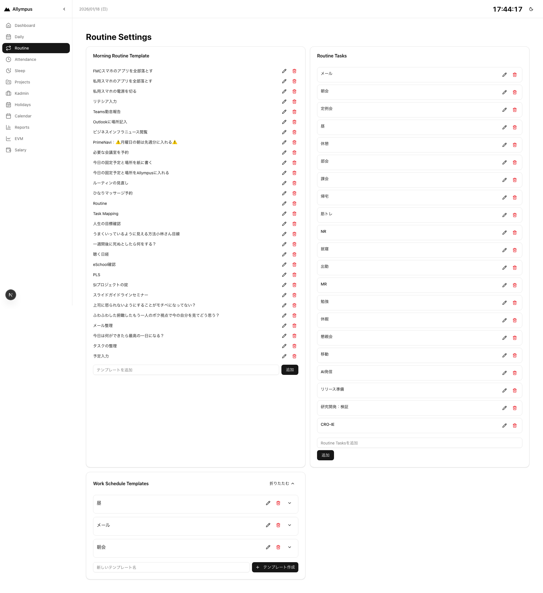

### レイアウト構成
```
┌────────────────────────────────────────────────────┐
│ Routine Settings                                   │
├────────────────────────────────────────────────────┤
│ ┌──────────────────┐  ┌──────────────────────────┐│
│ │Morning Routine   │  │Routine Tasks             ││
│ │Template          │  │                          ││
│ └──────────────────┘  └──────────────────────────┘│
│ ┌────────────────────────────────────────────────┐│
│ │Work Schedule Templates                         ││
│ │                                                ││
│ └────────────────────────────────────────────────┘│
└────────────────────────────────────────────────────┘
```

### 画面項目

#### ヘッダー
| 項目名 | 項目種別 | 表示内容 | 備考 |
|--------|----------|----------|------|
| タイトル | テキスト | Routine Settings | - |

#### Morning Routine Template カード
| 項目名 | 項目種別 | 操作 | 備考 |
|--------|----------|------|------|
| テンプレート項目リスト | リスト | [タイトル] [編集] [削除] | - |
| 新規追加入力 | テキスト | テンプレートを追加 | - |
| 追加ボタン | ボタン | 追加 | - |

#### Routine Tasks カード
| 項目名 | 項目種別 | 操作 | 備考 |
|--------|----------|------|------|
| タスクリスト | リスト | [タイトル] [編集] [削除] | - |
| 新規追加入力 | テキスト | Routine Tasksを追加 | - |
| 追加ボタン | ボタン | 追加 | - |

#### Work Schedule Templates
| 項目名 | 項目種別 | 操作 | 備考 |
|--------|----------|------|------|
| 曜日別テンプレート | タブ | 月〜日曜日 | 各曜日ごとの定型稼働予定 |
| テンプレート項目 | リスト | 開始時刻、終了時刻、プロジェクト、WBS | 追加/編集/削除可能 |

---

## 9. EVM

### 画面概要
EVM（Earned Value Management）管理画面。プロジェクトごとのPV/AC推移、CBI、固定タスク計画などを管理します。

### 画面イメージ
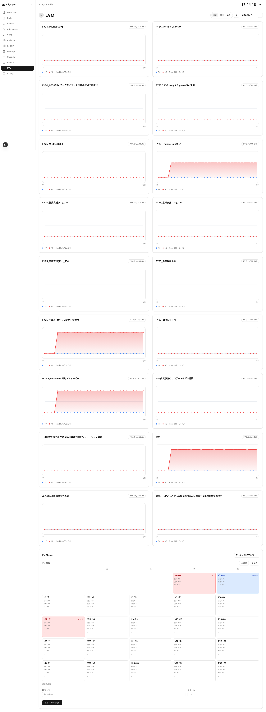

### レイアウト構成
```
┌────────────────────────────────────────────────────┐
│ 📈 EVM    [積算/日別/CBI] [←] YYYY年M月 [→]      │
├────────────────────────────────────────────────────┤
│ ┌──────────────────┐  ┌──────────────────────────┐│
│ │Project A         │  │Project B                 ││
│ │[PV/ACグラフ]     │  │[PV/ACグラフ]             ││
│ └──────────────────┘  └──────────────────────────┘│
├────────────────────────────────────────────────────┤
│ ┌────────────────────────────────────────────────┐│
│ │PV Planner                                      ││
│ │[カレンダー形式で固定タスク計画]               ││
│ └────────────────────────────────────────────────┘│
└────────────────────────────────────────────────────┘
```

### 画面項目

#### ヘッダー
| 項目名 | 項目種別 | 操作 | 備考 |
|--------|----------|------|------|
| アイコン | アイコン | - | LineChart |
| タイトル | テキスト | - | EVM |
| 表示モード | トグル | 積算 / 日別 / CBI | - |
| 前月ボタン | ボタン | クリック | - |
| 月表示 | テキスト | yyyy年 M月 | - |
| 次月ボタン | ボタン | クリック | - |

#### プロジェクトカード（複数）
| 項目名 | 項目種別 | 表示内容 | 備考 |
|--------|----------|----------|------|
| プロジェクト名 | テキスト | プロジェクト名 | - |
| PV/AC集計 | テキスト | PV Xh / AC Xh | - |
| グラフ | 折れ線グラフ | PV/ACまたはCBI | 表示モードに応じて切替 |
| 凡例 | テキスト | PV / AC / Fixed / Est | - |

**グラフ表示モード**
- 積算: PVとACの累積グラフ
- 日別: PVとACの日別グラフ
- CBI: CBI（AC/PV）の推移グラフ

#### PV Planner
| 項目名 | 項目種別 | 操作 | 備考 |
|--------|----------|------|------|
| プロジェクト選択 | セレクト | プロジェクト一覧 | - |
| 日付選択ボタン | ボタン | 全選択 / 全解除 / 月〜金 | - |
| カレンダー | グリッド | 平日のみ表示（月〜金） | 日付ごとに固定/変動/PV表示 |
| 日付セル | セル | 固定: Xh / 変動: Xh / PV: Xh | クリックで選択 |
| 固定タスク入力 | テキスト | 固定タスク名 | - |
| 工数入力 | 数値 | 工数（h） | - |
| 追加ボタン | ボタン | 固定タスクを追加 | - |

---

## 10. Salary

### 画面概要
給与管理画面。月別の給与情報（額面、手取り、各種控除、賞与）を記録・管理します。

### 画面イメージ
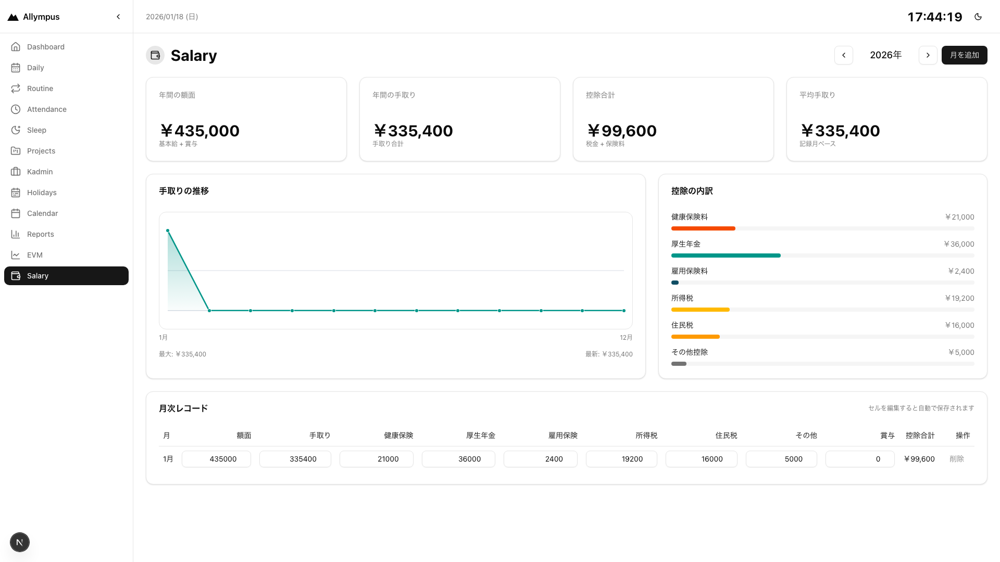

### レイアウト構成
```
┌────────────────────────────────────────────────────┐
│ 💰 Salary              [←] YYYY年 [→] [月を追加]  │
├────────────────────────────────────────────────────┤
│ ┌────┐ ┌────┐ ┌────┐ ┌────┐                      │
│ │年間│ │年間│ │控除│ │平均│                      │
│ │額面│ │手取│ │合計│ │手取│                      │
│ └────┘ └────┘ └────┘ └────┘                      │
├────────────────────────────────────────────────────┤
│ ┌──────────────────┐  ┌──────────────────────────┐│
│ │手取りの推移      │  │控除の内訳               ││
│ │[折れ線グラフ]    │  │[円グラフ]               ││
│ └──────────────────┘  └──────────────────────────┘│
├────────────────────────────────────────────────────┤
│ ┌────────────────────────────────────────────────┐│
│ │月次レコード [セルを編集すると自動で保存]      ││
│ │[編集可能テーブル]                              ││
│ └────────────────────────────────────────────────┘│
└────────────────────────────────────────────────────┘
```

### 画面項目

#### ヘッダー
| 項目名 | 項目種別 | 操作 | 備考 |
|--------|----------|------|------|
| アイコン | アイコン | - | Wallet |
| タイトル | テキスト | - | Salary |
| 前年ボタン | ボタン | クリック | - |
| 年表示 | テキスト | YYYY年 | - |
| 次年ボタン | ボタン | クリック | - |
| 月を追加ボタン | ボタン | クリック | 新しい月の給与レコード追加 |

#### サマリーカード
| カード名 | 表示項目 | 表示内容 |
|----------|----------|----------|
| 年間の額面 | 金額 | ¥X,XXX,XXX |
| 年間の手取り | 金額 | ¥X,XXX,XXX |
| 控除合計 | 金額 | ¥X,XXX,XXX |
| 平均手取り | 金額 | ¥X,XXX,XXX |

#### 手取りの推移グラフ
| 項目名 | 項目種別 | 表示内容 | 備考 |
|--------|----------|----------|------|
| グラフ | 折れ線グラフ | 1月〜12月の手取り推移 | - |
| 最大値表示 | テキスト | 最大: ¥X,XXX,XXX | - |
| 最新値表示 | テキスト | 最新: ¥X,XXX,XXX | - |

#### 控除の内訳
| 項目名 | 項目種別 | 表示内容 | 備考 |
|--------|----------|----------|------|
| 健康保険料 | プログレスバー | ¥XXX,XXX (割合%) | - |
| 厚生年金 | プログレスバー | ¥XXX,XXX (割合%) | - |
| 雇用保険料 | プログレスバー | ¥XXX,XXX (割合%) | - |
| 所得税 | プログレスバー | ¥XXX,XXX (割合%) | - |
| 住民税 | プログレスバー | ¥XXX,XXX (割合%) | - |
| その他控除 | プログレスバー | ¥XXX,XXX (割合%) | - |

#### 月次レコードテーブル
| 項目名 | 項目種別 | 入力形式 | 備考 |
|--------|----------|----------|------|
| 月 | テキスト | N月 | 読み取り専用 |
| 額面 | 数値入力 | 0〜 | 編集可能（自動保存） |
| 手取り | 数値入力 | 0〜 | 編集可能（自動保存） |
| 健康保険 | 数値入力 | 0〜 | 編集可能（自動保存） |
| 厚生年金 | 数値入力 | 0〜 | 編集可能（自動保存） |
| 雇用保険 | 数値入力 | 0〜 | 編集可能（自動保存） |
| 所得税 | 数値入力 | 0〜 | 編集可能（自動保存） |
| 住民税 | 数値入力 | 0〜 | 編集可能（自動保存） |
| その他 | 数値入力 | 0〜 | 編集可能（自動保存） |
| 賞与 | 数値入力 | 0〜 | 編集可能（自動保存） |
| 控除合計 | 計算値 | 自動計算 | 読み取り専用 |
| 操作 | ボタン | 削除 | - |

---

## 11. Sleep

### 画面概要
睡眠管理画面。月別の睡眠時間を記録・分析し、平均睡眠時間、目標達成率、曜日別パターンなどを可視化します。

### 画面イメージ
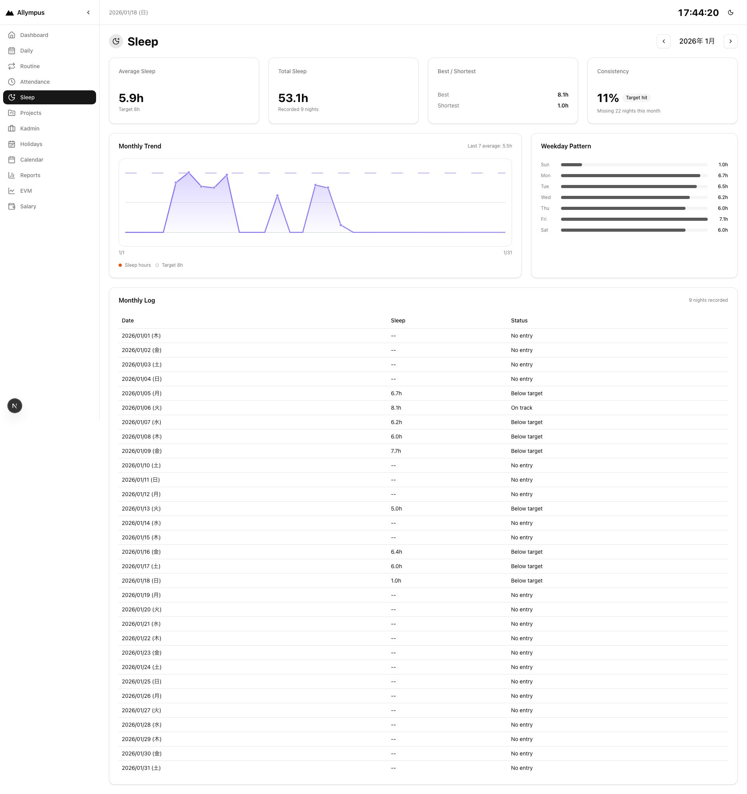

### レイアウト構成
```
┌────────────────────────────────────────────────────┐
│ 🌙 Sleep               [←] YYYY年M月 [→]          │
├────────────────────────────────────────────────────┤
│ ┌────┐ ┌────┐ ┌────┐ ┌────┐                      │
│ │平均│ │合計│ │最長│ │達成│                      │
│ │睡眠│ │睡眠│ │最短│ │率  │                      │
│ └────┘ └────┘ └────┘ └────┘                      │
├────────────────────────────────────────────────────┤
│ ┌──────────────────┐  ┌──────────────────────────┐│
│ │Monthly Trend     │  │Weekday Pattern           ││
│ │[折れ線グラフ]    │  │[棒グラフ]               ││
│ └──────────────────┘  └──────────────────────────┘│
├────────────────────────────────────────────────────┤
│ ┌────────────────────────────────────────────────┐│
│ │Monthly Log                                     ││
│ │[睡眠記録テーブル]                              ││
│ └────────────────────────────────────────────────┘│
└────────────────────────────────────────────────────┘
```

### 画面項目

#### ヘッダー
| 項目名 | 項目種別 | 操作 | 備考 |
|--------|----------|------|------|
| アイコン | アイコン | - | MoonStar |
| タイトル | テキスト | - | Sleep |
| 前月ボタン | ボタン | クリック | - |
| 月表示 | テキスト | yyyy年 M月 | - |
| 次月ボタン | ボタン | クリック | - |

#### サマリーカード
| カード名 | 表示項目 | 表示内容 |
|----------|----------|----------|
| Average Sleep | 平均睡眠時間 | X.Xh (Target 8h) |
| Total Sleep | 総睡眠時間 | X.Xh (Recorded N nights) |
| Best / Shortest | 最長/最短睡眠 | Best: X.Xh / Shortest: X.Xh |
| Consistency | 目標達成率 | N% (Target hit) + Missing N nights |

#### Monthly Trend グラフ
| 項目名 | 項目種別 | 表示内容 | 備考 |
|--------|----------|----------|------|
| グラフ | 折れ線グラフ | 1ヶ月分の睡眠時間推移 | 目標ライン（8h）付き |
| 直近7日平均 | テキスト | Last 7 average: X.Xh | - |

#### Weekday Pattern
| 項目名 | 項目種別 | 表示内容 | 備考 |
|--------|----------|----------|------|
| 曜日別平均 | 棒グラフ | Sun〜Satの各曜日の平均睡眠時間 | - |

#### Monthly Log テーブル
| 項目名 | 項目種別 | 表示内容 | 備考 |
|--------|----------|----------|------|
| Date | テキスト | yyyy/MM/dd (E) | - |
| Sleep | テキスト | X.Xh | - |
| Status | テキスト | No entry / Below target / On track | - |

---

## 12. Kadmin

### 画面概要
稼働管理画面（工数管理）。プロジェクトごとの月別予測/実績工数を管理し、残業時間を計算します。

### 画面イメージ
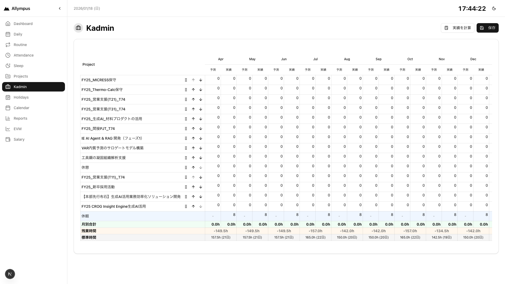

### レイアウト構成
```
┌────────────────────────────────────────────────────┐
│ 💼 Kadmin                  [実績を計算] [保存]    │
├────────────────────────────────────────────────────┤
│ ┌────────────────────────────────────────────────┐│
│ │大型スクロール可能テーブル                      ││
│ │Project | Apr    | May    | ... | 年間合計     ││
│ │        |予測実績|予測実績| ... |予測  実績    ││
│ │────────┼────────┼────────┼─────┼──────────── ││
│ │Proj A  | X  Y  | X  Y  | ... | XX   YY      ││
│ │Proj B  | X  Y  | X  Y  | ... | XX   YY      ││
│ │...                                             ││
│ │────────┼────────┼────────┼─────┼──────────── ││
│ │休暇    | -  X  | -  X  | ... | -    XX      ││
│ │月別合計| XX XX | XX XX | ... | XXX  XXX     ││
│ │残業時間|  XX   |  XX   | ... |      XXX     ││
│ │標準時間|XXh(Nd)|XXh(Nd)| ... |    XXXh      ││
│ └────────────────────────────────────────────────┘│
└────────────────────────────────────────────────────┘
```

### 画面項目

#### ヘッダー
| 項目名 | 項目種別 | 操作 | 備考 |
|--------|----------|------|------|
| アイコン | アイコン | - | Briefcase |
| タイトル | テキスト | - | Kadmin |
| 実績を計算ボタン | ボタン | クリック | TimeEntryから実績工数を自動計算 |
| 保存ボタン | ボタン | クリック | 全データを保存 |

#### 稼働時間テーブル

**ヘッダー行**
| 項目名 | 項目種別 | 表示内容 | 備考 |
|--------|----------|----------|------|
| Project | テキスト | Project | 固定列 |
| 月列（×12） | テキスト | Apr, May, Jun, ... Mar | 各月2列（予測/実績） |
| 年間合計 | テキスト | 年間合計 | 2列（予測/実績） |

**プロジェクト行（複数）**
| 項目名 | 項目種別 | 入力形式 | 備考 |
|--------|----------|----------|------|
| プロジェクト名 | テキスト | プロジェクト名 | ドラッグ可能、並び替えボタン付き |
| 月別予測工数（×12） | 編集可能セル | 0.0〜 | インライン編集、ペースト対応 |
| 月別実績工数（×12） | 編集可能セル | 0.0〜 | インライン編集、ペースト対応 |
| 年間予測合計 | 計算値 | XXX.Xh | 自動計算 |
| 年間実績合計 | 計算値 | XXX.Xh | 自動計算 |

**休暇行**
| 項目名 | 項目種別 | 入力形式 | 備考 |
|--------|----------|----------|------|
| 休暇 | テキスト | 休暇 | 固定 |
| 月別休暇（×12） | 編集可能セル | 0.0〜 | 実績列のみ編集可能 |
| 年間休暇合計 | 計算値 | XXX.Xh | 自動計算 |

**月別合計行**
| 項目名 | 項目種別 | 表示内容 | 備考 |
|--------|----------|----------|------|
| 月別合計 | テキスト | 月別合計 | 固定 |
| 月別予測合計（×12） | 計算値 | XXX.Xh | 全プロジェクトの縦計 |
| 月別実績合計（×12） | 計算値 | XXX.Xh | 全プロジェクトの縦計 |
| 年間予測総合計 | 計算値 | XXX.Xh | - |
| 年間実績総合計 | 計算値 | XXX.Xh | - |

**残業時間行**
| 項目名 | 項目種別 | 表示内容 | 備考 |
|--------|----------|----------|------|
| 残業時間 | テキスト | 残業時間 | 固定 |
| 月別残業（×12） | 計算値 | XX.Xh | 実績合計 - (標準時間 - 休暇) |
| 年間残業合計 | 計算値 | XXX.Xh | - |

**標準時間行（参考）**
| 項目名 | 項目種別 | 表示内容 | 備考 |
|--------|----------|----------|------|
| 標準時間 | テキスト | 標準時間 | 固定 |
| 月別標準時間（×12） | 計算値 | XXX.Xh (Nd) | 営業日 × 7.5h |
| 年間標準時間 | 計算値 | XXX.Xh | - |

### 操作方法
- **セル編集**: クリックして数値入力、Enterで確定
- **ペースト**: Excel等からコピーした複数セルを一括ペースト可能
- **並び替え**: ドラッグ&ドロップまたは↑↓ボタンでプロジェクト順序変更
- **実績計算**: 「実績を計算」ボタンでTimeEntryから自動集計
- **保存**: 「保存」ボタンで全データをサーバーに保存

---

## 補足情報

### 共通仕様

#### 時刻表示形式
- 時刻: HH:mm（24時間形式）
- 時間: Xh Ym（例: 7h 30m）
- 小数時間: X.Xh（例: 7.5h）

#### 日付表示形式
- yyyy年M月d日(E)（例: 2025年4月1日(火)）
- yyyy/MM/dd (E)（例: 2025/04/01 (火)）
- MM/dd（例: 04/01）

#### カラーコード（稼働タイプ）
- Project: 青系
- Support: 緑系
- Fixed: オレンジ系
- Break: グレー系

#### カラーコード（休日タイプ）
- PUBLIC_HOLIDAY: 赤系
- WEEKEND: グレー系
- SPECIAL_HOLIDAY: 青系
- PAID_LEAVE: 緑系

### データモデル対応

#### Attendance（勤怠）
- date: 日付
- clockIn: 出勤時刻
- clockOut: 退勤時刻
- breakMinutes: 休憩時間（分）
- workMode: 出社形態（Office/Telework/Out of Office）
- sleepHours: 睡眠時間

#### DailyTask（日次タスク）
- date: 日付
- title: タスク名
- status: ステータス（TODO/IN_PROGRESS/DONE）
- projectId: プロジェクトID
- wbsId: WBS ID

#### TimeEntry（稼働実績）
- dailyTaskId: タスクID
- projectId: プロジェクトID
- wbsId: WBS ID
- startTime: 開始時刻
- endTime: 終了時刻
- duration: 時間（秒）

#### Project（プロジェクト）
- code: プロジェクトコード
- name: プロジェクト名
- abbreviation: 略称
- workType: 稼働タイプ（Project/Support/Fixed/Break）
- isActive: アクティブフラグ
- isKadminActive: 稼働管理対象フラグ
- displayOrder: 表示順序
- kadminDisplayOrder: 稼働管理表示順序

#### Wbs（WBS）
- projectId: プロジェクトID
- name: WBS名
- code: WBSコード

#### Holiday（休日）
- fiscalYear: 年度（FY25等）
- date: 日付
- name: 休日名
- type: 種別（PUBLIC_HOLIDAY/WEEKEND/SPECIAL_HOLIDAY/PAID_LEAVE）

---

## 画面遷移図

```
Dashboard (/)
├─ Daily (/daily)
├─ Attendance (/attendance)
├─ Projects (/projects)
├─ Calendar (/calendar)
├─ Reports (/reports)
├─ Holidays (/holidays)
├─ Routine (/routine)
├─ EVM (/evm)
├─ Salary (/salary)
├─ Sleep (/sleep)
└─ Kadmin (/kadmin)
```

全ての画面はサイドバーまたはヘッダーナビゲーションから直接アクセス可能です。

---

## 更新履歴

| 日付 | バージョン | 更新内容 |
|------|-----------|----------|
| 2026-01-18 | 1.0 | 初版作成 |

